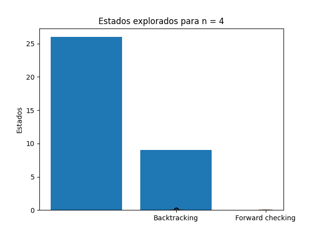
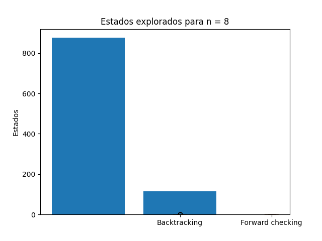
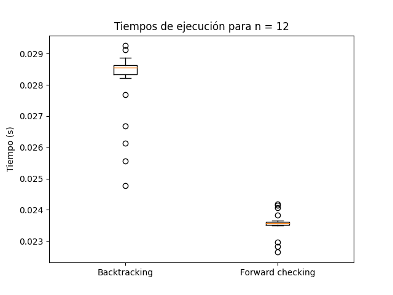

# TP6: CSP

- Hecho por: Agustín Yornet
- Legajo: 13921

## Formulación CSP para Sudoku

- Variables: $X = conjuntoDeCeldas = \{X_1,...,X_n\}$
- Dominio: $D = \{1,2,3,4,5,6,7,8,9 \}$
- Restricciones: $C = \{C_1,C_2,C_3\}$, donde:
    - $C_1$: Un dígito $D_n$ no puede aparecer más de una vez en una fila.
    - $C_2$: Un dígito $D_n$ no puede aparecer más de una vez en una columna.
    - $C_3$: Un dígito $D_n$ no puede aparecer más de una vez en una región.

## Solución del Ejercicio 2
> Utilizar el algoritmo AC-3 para demostrar que la arco consistencia puede detectar la inconsistencia de la asignación parcial $\{WA=red, V=blue\}$ para el problema del colorear el mapa de Australia.

El resultado de AC-3 es falso, debido a que el dominio de NSW se encuentra vacío y, por lo tanto, una inconsistencia ha sido encontrada.

La imagen, hecha en draw.io, ilustra las primeras iteraciones del algoritmo, y momentos para los cuales ningún valor $y$ del dominio de una ciudad $Y$ permite a $(x,y)$, siendo $x$ un valor dado del dominio de una ciudad $X$, satisfacer la restricción binaria $X!=Y$. En esas iteraciones, se van eliminando valores del dominio de $X$, y en el momento que una ciudad $X$ se queda sin valores en su dominio, se encuentra una inconsistencia, porque ninguna variable $X$ puede quedarse sin valores en su dominio.

## Análisis de complejidad de AC-3
> ¿Cuál es la complejidad en el peor caso cuando se ejecuta AC-3 en un árbol estructurado CSP? (i.e. Cuando el grafo de restricciones forma un árbol: cualquiera dos variables están relacionadas por a lo sumo un camino)

En el peor caso, la complejidad temporal de AC-3 es $O(ed^3)$, donde $e$ es el número de restricciones y $d$ el tamaño del máximo dominio en un problema. En un árbol estructurado CSP, hay $n-1$ restricciones binarias, siendo $n$ la cantidad de variables que hay en el problema. Por lo tanto, la complejidad temporal de AC-3 sobre un árbol estructurado CSP es de $O((n-1)\times d^3)$, ya que $e = n-1$.

## Modificación de AC-3

> AC-3 coloca de nuevo en la cola todo arco $(X_k, X_i)$ cuando cualquier valor es removido del dominio de $X_i$, incluso si cada valor de $X_k$ es consistente con los valores restantes de $X_i$. Supongamos que, por cada arco $(X_k,X_i)$, se puede llevar la cuenta del número de valores restantes de $X_i$ que sean consistentes con cada valor de $X_k$. Explicar cómo actualizar ese número de manera eficiente y demostrar que la arco consistencia puede lograrse en un tiempo total de $O(n^2d^2)$.

La idea consiste en preprocesar las restricciones de manera que, para cada valor de $X_i$, llevemos un registro de aquellas variables $X_k$ para las cuales un arco $X_k \to X_i$ se satisface con ese valor específico de $X_i$. Esta estructura de datos puede calcularse en un tiempo proporcional al tamaño de la representación del problema. Luego, cuando se elimina un valor de $X_i$, reducimos en 1 la cantidad de valores permitidos para cada arco $X_k \to X_i$ registrado bajo ese valor.

## Correctitud de AC-3 para árboles estructurados

>  Demostrar que para un CSP cuyo grafo de restricciones es un árbol, 2-consistencia (consistencia de arco) implica n-consistencia (siendo n número total de variables).

Empecemos por el lado izquierdo de la implicación:
- En un CSP, si hay consistencia de arco, significa que, para cada restricción binaria (una restricción que involucra dos variables), los valores en los dominios de las dos variables son consistentes entre sí.

Como el grafo CSP es un árbol estructurado, no hay ciclos en el grafo y las restricciones se organizan de manera jerárquica.

Suponiendo que tenemos 2-consistencia en el CSP, significa que, para cada restricción binaria, los valores en los dominios de las dos variables involucradas son consistentes. Ahora, si consideramos una restricción que involucra n variables en el CSP, donde n es el número total de variables en el problema, podemos aplicar la 2-consistencia en etapas, propagando restricciones desde las hojas del árbol hacia la raíz.

Comencemos por las restricciones binarias más cercanas a las hojas del árbol y avancemos hacia arriba. Dado que tenemos 2-consistencia, sabemos que las restricciones binarias son consistentes.

Cuando lleguemos a una restricción que involucre tres variables (i.e. A,B y C), notaremos que las dos primeras variables (A,B) ya han sido consideradas y son consistentes. Por lo tanto, podemos aplicar la 2-consistencia para asegurarnos de que la tercera variable (C) sea consistente con las dos primeras.

Repetimos este proceso a medida que avanzamos hacia la raíz del árbol, asegurándonos de que las restricciones de tres variables sean consistentes con las restricciones previamente consideradas. 

Al llegar a la raíz del árbol, habremos verificado que todas las restricciones que involucran n variables son consistentes, lo que cumple con la definición de n-consistencia.

## Resultados de backtracking y forward checking

### Para 4 reinas

### Para 8 reinas

### Para 10 reinas

### Para 12 reinas

### Para 15 reinas

