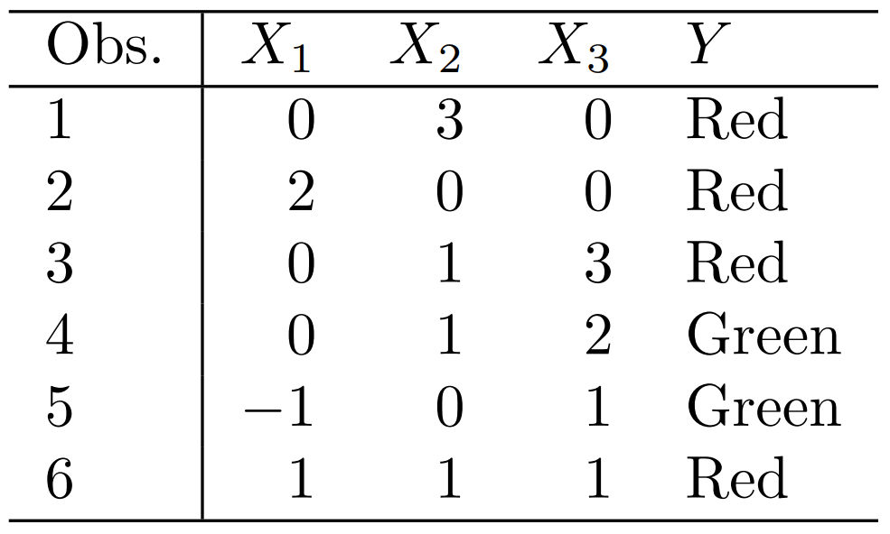

# TP7: Introducción a ML

- Hecho por: Agustín Yornet
- Legajo: 13921

# Ejercicio 1

## Consigna
For each of parts (a) through (d), indicate whether we would generally
expect the performance of a flexible statistical learning method to be
better or worse than an inflexible method. Justify your answer.
- (a) The sample size n is extremely large, and the number of predictors p is small.
- (b) The number of predictors p is extremely large, and the number
of observations n is small.
- (c) The relationship between the predictors and response is highly
non-linear.
- (d) The variance of the error terms, i.e. σ2 = Var(ϵ), is extremely
high.

## Resolución
### (a)

Si el tamaño del muestreo es grande y el número de predictores es pequeño, lo mejor sería usar un método más restrictivo gracias a la cantidad de información que podemos obtener, y calcular $\hat{f}$ sería más sencillo ya que el número de variables independientes también es menor.

### (b)

Cuando tenemos menor información, al contrario que en el inciso anterior, lo ideal sería buscar algún método más flexible. Ante la falta de información, es difícil encontrar una función $\hat{f}$ que modele a $Y$ también por la cantidad de parámetros que existen.

### (c)

Si sabemos que la relación entre $X$ e $Y$ no es lineal, lo ideal sería buscar métodos más flexibles. Sin embargo, si bien no es lineal, puede acercarse a serlo, por lo que hay que buscar un equilibrio entre lo flexible e inflexible.

### (d)

Como regla general, al usar métodos flexibles, aumenta la varianza. Lo ideal sería buscar un método flexible pero más restrictivo al mismo tiempo para disminuir la varianza sin aumentar demasiado el sesgo. De esta forma, el error cuadrático medio se mantiene relativamente bajo.

# Ejercicio 2
## Consigna
Explain whether each scenario is a classification or regression problem, and indicate whether we are most interested in inference or prediction. Finally, provide n and p.
- (a) We collect a set of data on the top 500 firms in the US. For each
firm we record profit, number of employees, industry and the
CEO salary. We are interested in understanding which factors
affect CEO salary.
- (b) We are considering launching a new product and wish to know
whether it will be a success or a failure. We collect data on 20
similar products that were previously launched. For each product we have recorded whether it was a success or failure, price
charged for the product, marketing budget, competition price,
and ten other variables.
- (c) We are interested in predicting the % change in the USD/Euro
exchange rate in relation to the weekly changes in the world
stock markets. Hence we collect weekly data for all of 2012. For
each week we record the % change in the USD/Euro, the %
change in the US market, the % change in the British market,
and the % change in the German market.

## Resolución
### (a)

Como nos interesa saber qué factores afectan el salario de un CEO, estamos queriendo saber la forma de $\hat{f}$, por lo que estamos ante un problema de regresión que requiere un enfoque en inducción. 
- $n = 500$
- $p = 3$

### (b)

Como nos interesa saber si nuestro producto va a ser exitoso o no, estamos ante un problema de clasificación que requiere un enfoque en la predicción.
- $n = 20$
- $p = 14$

### (c)

Como nos interesa predecir un dato en relación a otros datos previamente obtenidos, queremos obtener la forma de $\hat{f}$, por lo que estamos ante un problema de regresión que requiere un enfoque en la predicción. 
- $n = 52$
- $p = 4$

# Ejercicio 5

## Consigna
What are the advantages and disadvantages of a very flexible (versus
a less flexible) approach for regression or classification? Under what
circumstances might a more flexible approach be preferred to a less
flexible approach? When might a less flexible approach be preferred?

## Resolución
Un enfoque flexible para la regresión o clasificación tiene como ventaja que el error que se introduce al aproximar un problema de la vida real sea más pequeño, también denominado sesgo. Por el contrario, tiene como desventaja que $\hat{f}$ cambia considerablemente si es estimado por medio de otro conjunto de datos, es decir, aumenta la varianza. Si el verdadero $f$ no es lineal y tenemos un número amplio de observaciones de prueba, entonces un enfoque flexible va a producir mejores resultados. Por el contrario, si suponemos que el verdadero $f$ es lineal, entonces un método menos flexible, como la regresión lineal, no va a tener casi sesgo, por lo que es más preferible que un método más flexible.

# Ejercicio 6
## Consigna
Describe the differences between a parametric and a non-parametric
statistical learning approach. What are the advantages of a parametric approach to regression or classification (as opposed to a nonparametric approach)? What are its disadvantages?
## Resolución
Un enfoque paramétrico es aquel que asume la forma de $f$, y cuyo objetivo es entrenar al modelo por medio de la estimación de los parámetros que moldean a la función. Por el contrario, un enfoque no paramétrico no asume la forma que $f$ tiene. 

Asumir una forma paramétrica para $f$ simplifica el problema de estimar $f$ porque generalmente es mucho más fácil estimar un conjunto de parámetros que estimar la forma arbitraria que tiene la función $f$. La desventaja es que el modelo que se elija no va a coincidir siempre con la verdadera forma de $f$, y si nuestro modelo se aleja mucho de la forma real de la función, nuestra estimación va a ser pobre. 

# Ejercicio 7
## Consigna
The table below provides a training data set containing six observations, three predictors, and one qualitative response variable.

Suppose we wish to use this data set to make a prediction for Y when
X1 = X2 = X3 = 0 using K-nearest neighbors.
- (a) Compute the Euclidean distance between each observation and
the test point, X1 = X2 = X3 = 0.
- (b) What is our prediction with K = 1? Why?
- (c) What is our prediction with K = 3? Why?
- (d) If the Bayes decision boundary in this problem is highly nonlinear, then would we expect the best value for K to be large or
small? Why?

## Resolución

La distancia euclidiana entre dos puntos $p=(p_1,p_2,p_3)$ y $q=(q_1,q_2,q_3)$ puede calcularse como:
$$d(p,q) = \sqrt{(p_1-q_1)^2 + (p_2-q_2)^2 + (p_3-q_3)^2}$$

Sea $test$ nuestro punto de prueba. Usando esta fórmula, obtenemos los siguientes resultados:
$$
\begin {aligned}
d(1,test) &= 3\\
d(2,test) &= 2\\
d(3,test) &= 3.16\\
d(4,test) &= 2.24\\
d(5,test) &= 1.41\\
d(6,test) &= 1.73\\
\end {aligned}
$$

### (b) 
**Verde**; la observación más cercana es la verde.

### (c)
**Rojo**; las observaciones más cercanas son verde, rojo y como. Como la probabilidad del rojo es mayor a la del verde, la predicción es rojo. 

### (d)
Para límites no lineales, esperaríamos que el mejor valor de K fuera pequeño. Valores más pequeños de K dan como resultado un modelo más flexible, y esto produciría un límite de decisión que no es lineal. Una K mayor significaría que el modelo KNN considera más puntos de datos y esto significa que su límite de decisión está más cerca de una forma lineal.